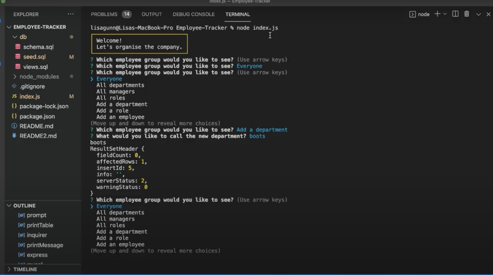
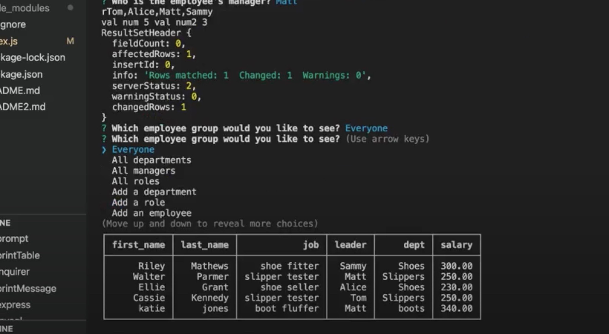

# Employee Tracker

In this project I built a command-line application from scratch to manage a company's employee database, using Node.js, Inquirer, and MySQL. My motivation for this project is to highlight the use of content management systems (CMS), as developers frequently have to create interfaces that allow non-developers to easily view and interact with information stored in databases. The purpose of this project is to highlight the use of MySQL in creating tables of databases. Something I have learnt through creating this application is working to maximise the manipulation of the data in the sql files, for instance creating additional tables as views to reduce the amount of JavaScript I had to write. 

## User Story
```
AS A business owner
I WANT to be able to view and manage the departments, roles, and employees in my company
SO THAT I can organize and plan my business
```

## Technologies Used

* MySQL2 package
* Inquirer package
* console.table package
* nodemon package
* Node.js
* JavaScript
* Express.js 
* JSON

## Criteria that I Met to Achieve this

* When the user starts the application they are presented with the following options: view all departments, view all roles, view all employees, add a department, add a role, add an employee, and update an employee role.
* When the user chooses to view all departments then they are presented with a formatted table showing department names and department ids.
* When the user chooses to view all roles they are presented with the job title, role id, the department that role belongs to, and the salary for that role.
* When the user is presented with the job title, role id, the department that role belongs to, and the salary for that role.
* When the user chooses to view all employees, they are presented with a formatted table showing employee data, including employee ids, first names, last names, job titles, departments, salaries, and managers that the employees report to.
* When the user chooses to add a department, then they are prompted to enter the name of the department and that department is added to the database.
* When the user chooses to add a role, then they are  prompted to enter the name, salary, and department for the role and that role is added to the database.
* When the user chooses to add an employee, then they are prompted to enter the employee’s first name, last name, role, and manager, and that employee is added to the database.
* When the user chooses to update an employee role, then they are prompted to select an employee to update and their new role and this information is updated in the database. 

## Application

### Link to Walkthrough Video
[Walkthrough Videos](https://drive.google.com/file/d/14OtyBqN__AYTHKlLahso-SlcV5Hg6Q3u/view)

### Use of Inquirer


### Table Formed


### Link to Github Repository
[Github Repository](https://github.com/LisaCR01/Employee-Tracker.git)

## Contact Me
* [Email](mailto:lcrgunn@gmail.com)
* [Github](https://github.com/LisaCR01)
* [LinkedIn](https://www.linkedin.com/in/LisaCR01)


